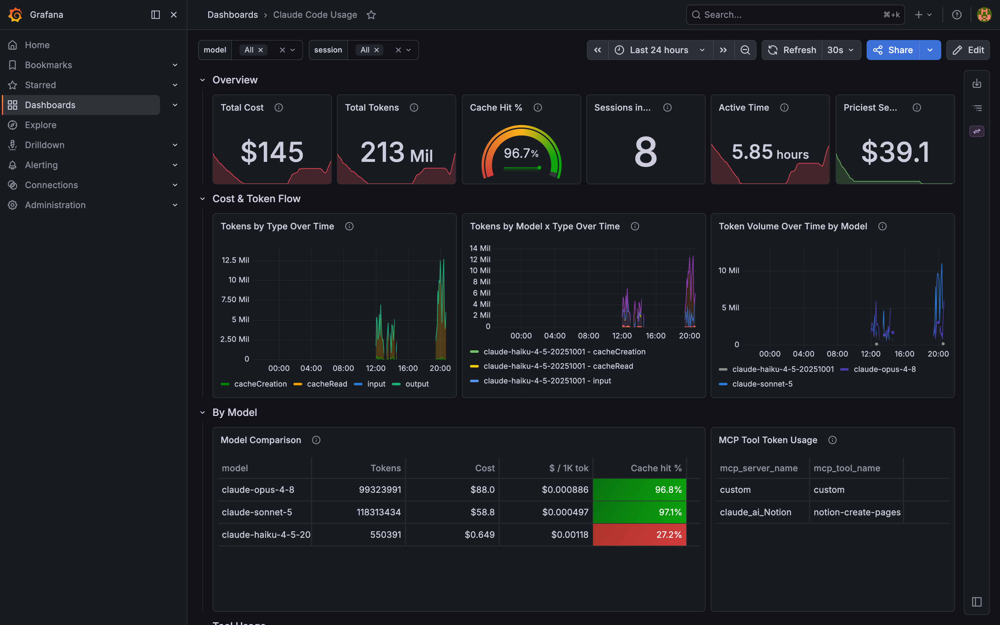
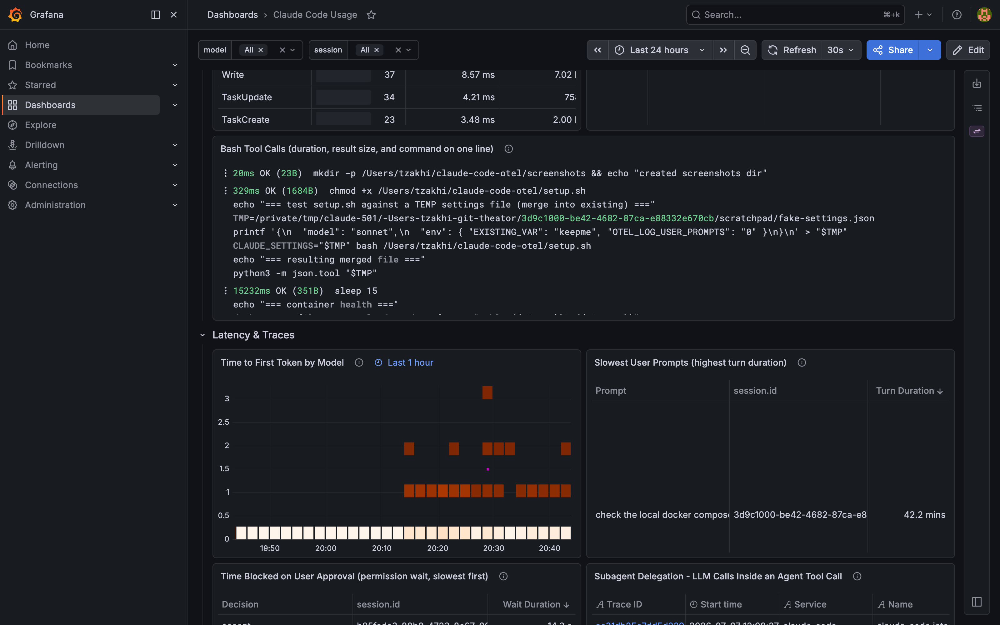
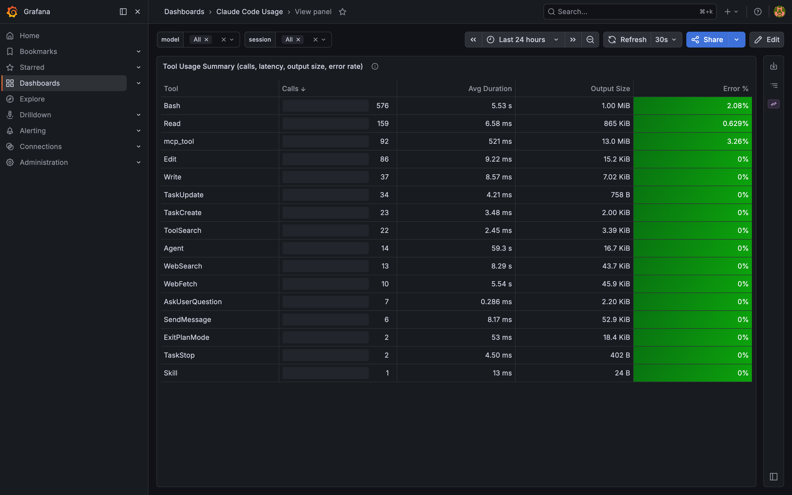
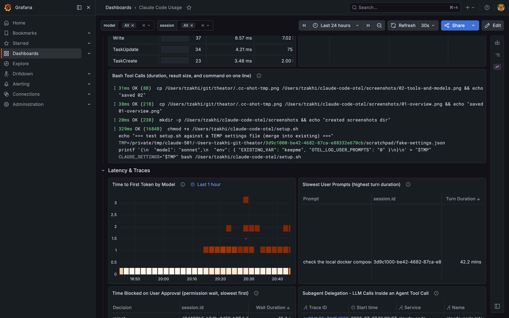

# Claude Code Telemetry Dashboard

A one-command, fully local observability stack for [Claude Code](https://claude.com/claude-code)'s
built-in OpenTelemetry export. Point Claude Code at `localhost:4318` and get a rich,
pre-provisioned Grafana dashboard of your **cost, tokens, cache efficiency, tool usage,
per-turn latency, and the actual prompts + shell commands behind your slowest turns** —
plus full trace waterfalls in Grafana Tempo and Arize Phoenix.

Everything runs on your machine. No data leaves your laptop.



---

## Quick start

```bash
git clone <this-repo> claude-code-otel
cd claude-code-otel

make start        # configures Claude Code telemetry + starts the stack
```

Then run Claude Code in any project as usual, and open **http://localhost:3000** — the
Claude Code dashboard is the landing page (no login).

`make start` does two things:

1. **`make setup`** — merges the telemetry env vars into your `~/.claude/settings.json`
   (backing it up first, never clobbering keys you've already set).
2. **`make up`** — starts the two containers.

> Already have Claude Code sessions open? Restart them so they pick up the new settings.

---

## What you get

A single dashboard, organized top-to-bottom from "how much / how healthy" down to "what
exactly happened", across seven sections:

| Section | Answers |
|---|---|
| **Overview** | Total cost, total tokens, cache-hit %, sessions in range, active time, priciest session — for the selected time window. |
| **Cost & Token Flow** | Token volume over time by type (input/output/cacheRead/cacheCreation) and by model. |
| **By Model** | One-row-per-model comparison: tokens, cost, $/1K tokens, cache hit %, p50/p95/avg latency, error %, lines added. Plus MCP-tool token attribution. |
| **Tool Usage** | Per-tool summary (calls, avg duration, output bytes, error %), the slowest individual tool calls, and a readable Bash command log. |
| **Latency & Traces** | Time-to-first-token heatmap, slowest user prompts (with the prompt text), time blocked on *your* approval, subagent delegation, and a trace explorer that deep-links into Tempo waterfalls. |
| **Session & Context Health** | Top sessions by tokens with cost + active time, sessions by terminal, and compaction events (pre/post token counts) — the "long-session anti-pattern" view. |
| **Code Productivity & Errors** | Lines added/removed, edit-tool decisions by language, git activity, and API errors/exhausted retries. |



The **Tool Usage Summary** merges what would otherwise be four panels into one at-a-glance
table — call counts, latency, context injected, and failure rate per tool:



And because `OTEL_LOG_USER_PROMPTS` and traces are on, you can see the **actual prompt text
and shell commands behind your slowest turns**, not just anonymous durations:



Two dashboard variables at the top — **model** and **session** — filter the whole board.

---

## How it works

```
                    ┌──────────────────────────────────────────────┐
  Claude Code  ───▶ │  grafana/otel-lgtm  (:4317 gRPC / :4318 HTTP) │
  (OTLP export)     │                                              │
                    │   metrics ─▶ Prometheus  ┐                   │
                    │   logs    ─▶ Loki         ├─▶ Grafana (:3000) │
                    │   traces  ─▶ Tempo       ┘                   │
                    └───────────────────┬──────────────────────────┘
                                        └─ traces also ─▶ Arize Phoenix (:6006)
```

Claude Code's CLI has OpenTelemetry built in: it emits **metrics** (token/cost/session
counters), **log events** (prompts, tool results, API errors), and — with the beta flag —
**traces** (a span per interaction / model request / tool call). This stack receives all
three over OTLP, stores them in the [Grafana LGTM](https://github.com/grafana/docker-otel-lgtm)
all-in-one, and ships a dashboard that reads across all three signals. Traces are *also*
forwarded to [Arize Phoenix](https://github.com/Arize-ai/phoenix) for LLM-native trace
inspection.

The `otelcol-config.yaml` handles two Claude-Code-specific quirks: it converts the CLI's
delta-temporality metric counters to cumulative (Prometheus rejects delta sums), and copies
Claude Code's flat token attributes onto the OpenInference `llm.token_count.*` names Phoenix
expects.

---

## Telemetry configuration

`make setup` writes these into your `~/.claude/settings.json` `env` block. If you'd rather
do it by hand — or set them per-project or in your shell — here's the exact set
([official reference](https://code.claude.com/docs/en/monitoring-usage)):

```json
{
  "env": {
    "CLAUDE_CODE_ENABLE_TELEMETRY": "1",
    "CLAUDE_CODE_ENHANCED_TELEMETRY_BETA": "1",
    "OTEL_METRICS_EXPORTER": "otlp",
    "OTEL_LOGS_EXPORTER": "otlp",
    "OTEL_TRACES_EXPORTER": "otlp",
    "OTEL_EXPORTER_OTLP_PROTOCOL": "http/protobuf",
    "OTEL_EXPORTER_OTLP_ENDPOINT": "http://localhost:4318",
    "OTEL_METRIC_EXPORT_INTERVAL": "10000",
    "OTEL_LOGS_EXPORT_INTERVAL": "5000",
    "OTEL_TRACES_EXPORT_INTERVAL": "5000",
    "OTEL_LOG_USER_PROMPTS": "1",
    "OTEL_LOG_TOOL_DETAILS": "1"
  }
}
```

| Variable | Why it's here |
|---|---|
| `CLAUDE_CODE_ENABLE_TELEMETRY` | Master switch — nothing exports without it. |
| `CLAUDE_CODE_ENHANCED_TELEMETRY_BETA` | Enables **traces** (interaction / llm_request / tool spans). Required for the Latency & Traces section. |
| `OTEL_*_EXPORTER=otlp` + `OTEL_EXPORTER_OTLP_*` | Send all three signals over OTLP HTTP to the local collector. |
| `OTEL_*_EXPORT_INTERVAL` | Lowered from the defaults (60s metrics / 5s logs) so data shows up quickly during local use. |
| `OTEL_LOG_USER_PROMPTS` | Adds your prompt text to `user_prompt` events + interaction spans — powers the "Slowest User Prompts" panel. |
| `OTEL_LOG_TOOL_DETAILS` | Adds tool inputs (shell commands, file paths) to `tool_result` events — powers the Bash command log and slowest-tool-calls. |

### Privacy

`OTEL_LOG_USER_PROMPTS` and `OTEL_LOG_TOOL_DETAILS` capture your prompt text and tool inputs.
**All of it stays on your machine** — the stack is local-only and Grafana isn't exposed off
`localhost`. If you'd still rather not record that content, set either to `"0"`; the numeric
panels (cost, tokens, latency, error rates) all keep working, you just lose the prompt/command
text columns.

---

## Ports

| Port | Service |
|---|---|
| 3000 | Grafana UI (dashboard) |
| 6006 | Arize Phoenix UI + OTLP trace ingest |
| 4317 / 4318 | OTLP gRPC / HTTP (Claude Code → collector) |
| 9090 | Prometheus API (debugging) |
| 3100 | Loki API (debugging) |
| 3200 | Tempo API (debugging) |

---

## Commands

```bash
make setup      # configure Claude Code telemetry (merges into ~/.claude/settings.json)
make up         # start the stack
make down       # stop (keeps stored telemetry)
make restart    # recreate (picks up dashboard/compose edits)
make logs       # tail logs
make ps         # status
make clean      # stop and DELETE all stored telemetry (removes volumes)
make start      # setup + up
```

## Editing the dashboard

The dashboard is provisioned from `grafana-dashboards/claude-code.json` and hot-reloads
(Grafana re-reads it every 10s). Edit the JSON and the change appears — no restart needed.
If Docker's bind-mount cache goes stale and edits don't show, `make restart`.

> Grafana's "Save dashboard" button won't persist to the file (provisioned dashboards are
> read-only from the UI). Use the JSON as the source of truth, or "Export" from the UI and
> copy the result back into the file.

---

## Repo layout

```
claude-code-otel/
├── docker-compose.yml              # the two-container stack (pinned images)
├── otelcol-config.yaml             # OTLP collector: delta→cumulative, OpenInference token remap, Tempo+Phoenix fan-out
├── grafana-dashboards/
│   ├── claude-code.json            # the dashboard (source of truth)
│   └── provisioning.yaml           # tells Grafana to load it
├── settings.claude.example.json    # the telemetry env block to add to Claude Code
├── setup.sh                        # merges that block into ~/.claude/settings.json (safe, backs up)
├── Makefile                        # make up / down / setup / start / ...
├── screenshots/                    # dashboard images used in this README
├── proxy.py, dashboard.html, ui/   # optional standalone browser dashboards (not required)
└── LICENSE
```

## Troubleshooting

- **Dashboard is empty / "No data".** Run some Claude Code turns first (metrics export on an
  interval). Confirm telemetry is on: `grep -A2 CLAUDE_CODE_ENABLE_TELEMETRY ~/.claude/settings.json`.
  Confirm the collector is receiving: `docker compose logs lgtm | grep -i otlp`.
- **Traces section empty.** You need `CLAUDE_CODE_ENHANCED_TELEMETRY_BETA=1` *and* a restarted
  Claude Code session.
- **Edited the JSON but nothing changed.** `make restart` (Docker Desktop bind-mount caching).
- **Port already in use.** Something else owns 3000/4318/etc. Stop it or remap the port in
  `docker-compose.yml`.

## Credits

- Built on [`grafana/otel-lgtm`](https://github.com/grafana/docker-otel-lgtm) and
  [Arize Phoenix](https://github.com/Arize-ai/phoenix).
- Inspired by the Claude Code observability community, notably
  [ColeMurray/claude-code-otel](https://github.com/ColeMurray/claude-code-otel).
- Telemetry semantics per the [Claude Code monitoring docs](https://code.claude.com/docs/en/monitoring-usage).

## License

MIT — see [LICENSE](LICENSE).
